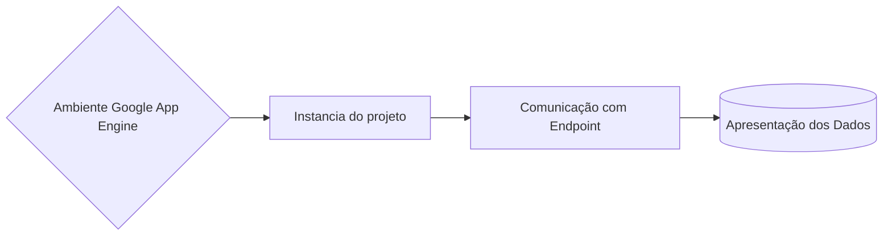
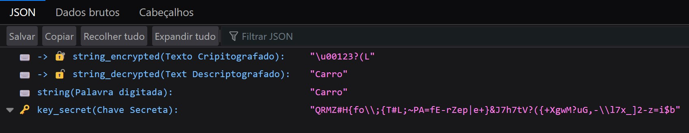

# Cryptography

## Descrição do projeto

O Cryptography(Criptografia) tem o objetivo em criptografar um determinado "Texto", e gerar uma chave para descriptografar o texto posteriormente.
O projeto foi hospedado no Google App Engine, tendo o objetivo em executar por "endpoint" para apresentação na Universidade Católica de Brasília, matéria de 
Serviços Computacionais em Nuvem.

## Deploying

1. Use o [Google Developers Console](https://console.developer.google.com) para criar um ID de projeto/aplicativo. (ID do aplicativo e ID do projeto são idênticos)

2. Configure o gcloud com o ID do seu aplicativo.

   ```
   gcloud config set project <your-app-id>
   ```

3. Use gcloud para implantar seu aplicativo.

   ```
   gcloud app deploy
   ```

4. Parabéns! Seu aplicativo agora está ativo em `your-app-id.appspot.com`

## Fluxograma



## Execução

- Script: [main.py](./main.py)
- Comunicação: https://snappy-tine-389700.uc.r.appspot.com + Métodos

-> Exemplos:

```sh
https://snappy-tine-389700.uc.r.appspot.com/?str=Carro&descp=true
```

-> Métodos:

```sh
str=Carro #String (Texto) digitado.
```

```sh
descp=true #Descript Paramento que determinar se o código deve ou não apresentar o texto descriptografado.
```

-> Resultado:



## ✔️ Técnicas e tecnologias utilizadas

- ``Google App Engine``
- ``Python 3.11.3``
- ``Flask 2.3.2``
